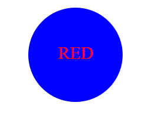
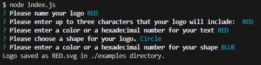

# Logo-Maker

## Visuals
  
  
[Link to video demonstration](https://drive.google.com/file/d/1aTOyYD5F82hXvXjJ_mAypuXQcDy4Pphq/view)

## Description
  This application allows users to quickly create .svg logos for their own personal use. The user needs to enter "node index.js" in the command-line in order to start the prompts. From there, the image will be created using the answers given.

## Table of Contents
- [Logo-Maker](#logo-maker)
  - [Visuals](#visuals)
  - [Description](#description)
  - [Table of Contents](#table-of-contents)
  - [Installation](#installation)
  - [Usage](#usage)
  - [License](#license)
  - [Tests](#tests)
  - [Contributors](#contributors)

## Installation
Packages required to use this application: Node, Inquirer, and Jest

## Usage
The purpose of this applications is to give users the ability to quickly  make their own logos with 0-3 characters inside without having to code it themselves.

## License
MIT

## Tests
To run a test, run this command: npm test

## Contributors
Link to creator's GitHub: [Steveb175](https://github.com/Steveb175)

